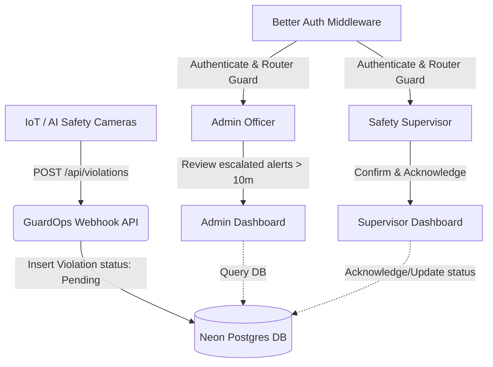

# GuardOps: Workforce Safety & PPE Monitoring Platform
## Final Technical Documentation & Architecture Guide

---

## 1. Executive Summary & Problem Statement

### The Problem
In industrial and high-risk environments (such as oil refineries, manufacturing sites, and construction zones), ensuring that workers adhere to safety protocols is critical. Specifically:
- **PPE Non-Compliance:** Human oversight often misses workers failing to wear helmets, high-visibility vests, or securing safety harnesses.
- **Incident Escalation Lag:** When safety breaches occur, supervisors are often notified too late, leading to increased risk of injury and regulatory compliance issues.
- **Data Silos:** Lack of a unified system to ingest real-time IoT/camera telemetry, assign cases to safety supervisors, track resolution times, and export compliance reports for audits.

### The GuardOps Solution
GuardOps is a comprehensive safety telemetry registry and management application that:
1. **Ingests Webhook Telemetry:** Provides an API endpoint `/api/violations` for IoT safety cameras to send real-time worker safety violations.
2. **Schedules Automated Escalations:** Identifies safety breaches that remain unacknowledged for more than 10 minutes and shifts them to a high-priority "Safety Alerts Registry" visible to Admins.
3. **Role-Based Access Control (RBAC):** Restructures views dynamically using Better Auth so Admins manage personnel while Supervisors acknowledge and handle site breaches.
4. **Interactive Dashboard & Auditing:** Displays interactive graphs of compliance rates and provides safety score calculations and one-click exports to CSV formats.

---

## 2. System Architecture & Flow



---

## 3. Directory & Folder Structure

Here is the finalized layout of the active codebase:

```
workforce-safety-monitoring-platform/
├── app/                              # Next.js App Router (Restructured)
│   ├── (auth)/                       # Auth Route Group
│   │   └── sign-in/                  # Login / Register page
│   ├── (admin)/                      # Admin Route Group
│   │   ├── admin/
│   │   │   ├── alerts/               # Safety alerts registry list (Escalated >10 mins)
│   │   │   ├── analytics/            # Administrative analytics dashboard
│   │   │   ├── dashboard/            # Main Admin dashboard page
│   │   │   ├── supervisors/          # Supervisor CRUD management
│   │   │   └── workers/              # Workers CRUD registry
│   │   ├── layout.tsx                # Shared Admin navigation layout
│   │   └── loading.tsx               # Admin section-wide loading skeleton
│   ├── (supervisor)/                 # Supervisor Route Group
│   │   ├── supervisor/
│   │   │   ├── analytics/            # Supervisor analytics views
│   │   │   ├── dashboard/            # Main Supervisor dashboard page
│   │   │   ├── reports/              # Compliance report generator & CSV export
│   │   │   └── violations/           # PPE violations tracking & resolution
│   │   ├── layout.tsx                # Shared Supervisor navigation layout
│   │   └── loading.tsx               # Supervisor section-wide loading skeleton
│   ├── api/                          # Backend API Routes
│   │   ├── auth/                     # Better Auth system endpoints
│   │   └── violations/               # Webhook ingestion endpoint
│   ├── globals.css                   # Global CSS & Tailwind styling variables
│   ├── layout.tsx                # Root layout wrapped in ToastProvider
│   └── page.tsx                      # Root page (Smart redirect based on Auth session role)
│
├── components/                       # Shared React Components
│   ├── auth-form.tsx                 # Better Auth Login / Signup Form
│   ├── ui/
│   │   └── toast.tsx                 # Custom Toast notification context & hook
│   ├── dashboard/                    # Dashboard specific cards & metric widgets
│   ├── layout/                       # Header and Navigation sidebar
│   ├── supervisors/                  # Supervisor manager components
│   ├── violations/                   # Violation tracker lists
│   └── workers/                      # Worker filter, pagination, & action components
│
├── actions/                          # Server Actions
│   ├── alerts.ts                     # Fetches escalated violations (> 10m)
│   ├── analytics.ts                  # Computes telemetry charts data
│   ├── auth.ts                       # Better Auth helper server actions
│   ├── dashboard.ts                  # Calculates Admin & Supervisor metrics
│   ├── supervisors.ts                # Creates and deletes supervisor accounts
│   ├── violations.ts                 # Acknowledges PPE violations
│   └── workers.ts                    # Query filters and updates workers
│
├── lib/                              # Logic & Core configuration
│   ├── db/
│   │   ├── index.ts                  # Database client pool initialization
│   │   └── schema.ts                 # Drizzle schema definition & index optimization
│   ├── auth-client.ts                # Better Auth browser/client initialization
│   ├── auth.ts                       # Better Auth server/core configuration
│   ├── csv.ts                        # Helper for formatting data to CSV downloads
│   ├── escalation.ts                 # Escalation timer formatting utilities
│   └── utils.ts                      # CSS styling classes merger utility
│
├── scripts/                          # Seeding Scripts
│   ├── seed-demo-users.ts            # Seeds default accounts (Admin, Supervisor)
│   ├── seed-violations.ts            # Seeds dummy PPE violations
│   └── seed-workers.ts               # Imports workers database from Excel
└── workers_dataset.xlsx              # Raw Excel spreadsheet dataset containing worker profiles
```

---

## 4. Detailed Component Walkthrough

### 1. Database Layer (`lib/db/schema.ts`)
- **Schema & Optimization:** Leverages serverless Neon Postgres. High-frequency queries (e.g., status lookups, created timestamps) are indexed for speed:
  - `user`: Index on `role`.
  - `violation`: Indexes on `status`, `createdAt`, `workerId`, and `locationId`.
  - `alert`: Indexes on `status`, `severity`, and `createdAt`.
- **Better Auth Integration:** Adapts tables (`user`, `session`, `account`, `verification`) automatically.

### 2. Authentication & Guard Rails (`app/middleware.ts`)
- **Dynamic Session Extraction:** Uses Better Auth hooks to inspect the user context.
- **Route Guarding:** Automatically intercepts unauthorized routes (e.g., redirecting standard workers away from admin panels, keeping supervisors restricted to safety actions).

### 3. Camera Ingestion API (`app/api/violations/route.ts`)
- External cameras make a `POST` request supplying `workerId`, `site` location, and `violationType` (e.g., `missing_helmet`, `missing_vest`).
- Checks if the worker profile exists in the DB, registers a default site profile if it is a new location, and inserts the safety breach into the `violation` table as `Pending` status.

### 4. Custom UI Enhancements (`components/ui/toast.tsx`)
- **Toast Notifications:** A zero-dependency toast system displaying success, error, warning, and info messages.
- **Interactive Modals:** Added confirmation modals for critical workflows:
  - Deleting supervisor accounts.
  - Deleting worker profiles.
  - Acknowledging violation alerts (Supervisor Dashboard).

---

## 5. Setup & Verification

See the root `README.md` for environmental configuration steps. Run locally with:
```bash
pnpm install
pnpm drizzle-kit push
npx tsx scripts/seed-workers.ts
pnpm dev
```
To verify the production build:
```bash
pnpm run build
```
The Next.js Turbopack compiler optimizes routes and outputs 100% successful static/dynamic pages.
